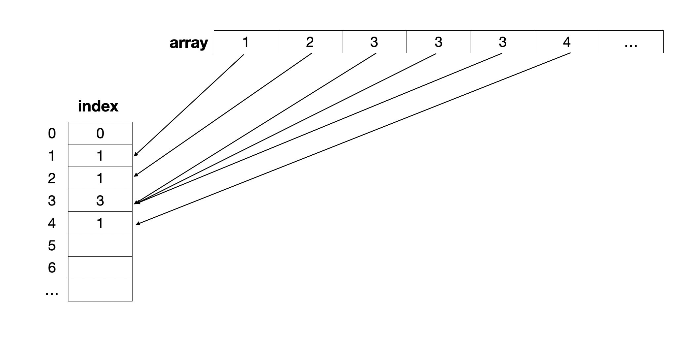

# **[최빈값 구하기](https://school.programmers.co.kr/learn/courses/30/lessons/120812)**

### **문제 설명**

최빈값은 주어진 값 중에서 가장 자주 나오는 값을 의미합니다. 정수 배열 array가 매개변수로 주어질 때, 최빈값을 return 하도록 solution 함수를 완성해보세요. 

최빈값이 여러 개면 -1을 return 합니다.

### **제한사항**

* 0 < array의 길이 < 100
* 0 ≤ array의 원소 < 1000

### **입출력 예**
|array|result|
|:--:|:--:|
|[1,2,3,3,3,4]|3|
|[1,1,2,2]|-1|
|[1]|1|

### **입출력 예 설명**
**입출력 예 #1**
* [1, 2, 3, 3, 3, 4]에서 1은 1개 2는 1개 3은 3개 4는 1개로 최빈값은 3입니다.

**입출력 예 #2**
* [1, 1, 2, 2]에서 1은 2개 2는 2개로 최빈값이 1, 2입니다. 최빈값이 여러 개이므로 -1을 return 합니다.

**입출력 예 #3**
* [1]에는 1만 있으므로 최빈값은 1입니다.

### **문제 풀이**
MODE 알고리즘

1) index 배열을 0으로 초기화한다.
2) array에 담긴 정수에 해당하는 인덱스에 1을 증가시킨다.
3) index 배열 내에서 중복값이 가장 많은 값이 최빈값이 된다.